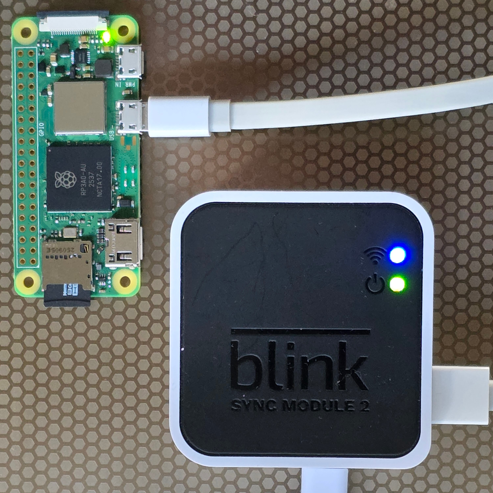
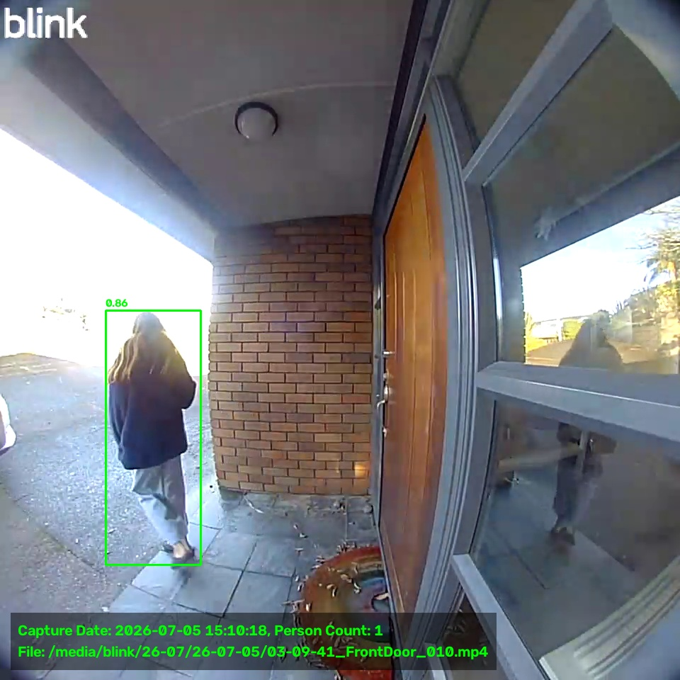
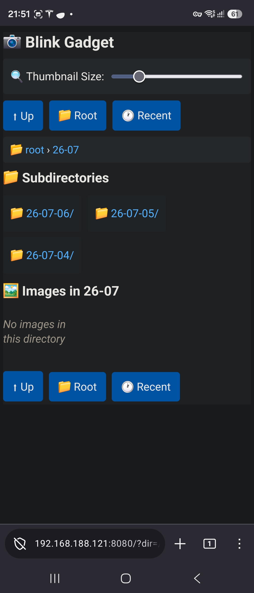
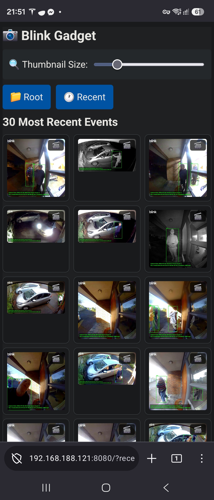
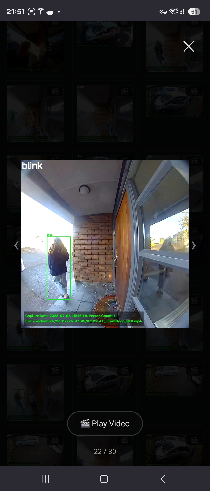

# blink-gadget

**This project uses a Raspberry Pi Zero 2W connected to a Blink Sync Module 2 that masquerades as a USB flash drive, allowing Linux to access the video files written by the Sync Module.**

---

## Overview

This repository enables remote access and analysis of video files from Blink security cameras. By converting a Raspberry Pi into a virtual USB flash drive connected directly to your Blink Sync Module 2, you can restore key features that are normally locked behind a subscription.

### What You Gain

Blink cameras without a subscription lack:
- Image thumbnails (videos must be manually viewed)
- Person detection (subscription identifies events with people)
- Cloud storage

This project restores these features by adding:
- **Thumbnail image generation** from video events (accesible without the Blink app)
- **Person detection** using YOLOv8 object detection
- **Local video storage** and backup (accessible to Linux, beyond the Blink app)
- **Cloud backup** opportunity to storage videos and/or thumbnails on other devices or the cloud

---

## Requirements

| Requirement | Specification |
|---|---|
| **Blink Camera or Doorbell** | Compatible with Sync Module 2 |
| **Blink Module** | Sync Module 2 with USB port |
| **Raspberry Pi** | Pi Zero 2W (recommended) or Pi 4, 400, 5, 500, 500+ with USB OTG support |
| **SD Card** | 16GB or larger (Raspberry Pi OS Lite 64-bit, trixie) |

**Note:** The Pi Zero 2W works directly without additional cables. Other Pi models require a [special USB cable](images/rpi4_special_cable.md) setup.

---

## Quick Setup

### Prepare the SD Card

Install **Raspberry Pi OS Lite (64-bit, trixie)** on your SD card (16GB minimum). Configure your WiFi credentials during setup, as you'll access the Pi remotely via SSH.

### Power the Pi from the Sync Module

Connect the Sync Module 2 to the Pi Zero 2W's USB OTG port (nearest the HDMI port) using a standard USB-A to Micro-B cable:

 

```
┌──────────────────────────────────────────────────────────────────────────────────────────┐
│                        USB Type-A to Micro-USB Type-B Cable                              │
│    Raspberry Pi                                                       Blink Sync         │
│      Zero 2W                                                           Module 2          │
│  ┌──────────────┐                                                ┌──────────────────┐    │
│  │              │                                                │                  │    │
│  │     Micro-B  │════════════════════════════════════════════════┤ USB-A            │    │
│  │       OTG    │                                                │                  │    │
│  │              │                                                │     Micro-B      │    │
│  └──────────────┘                                                └──────────────────┘    │
│    Pi is powered                                                          ▲              │
│    by USB cable                                                           │              │
│                                                                           │              │
│                                                                   ┌───────┴─────────┐    │
│                                                                   │                 │    │
│                                        Recommended to upgrade     │     5V 2A       │    │
│                                        Sync Module PSU to 2A      │      PSU        │    │
│                                                                   │                 │    │
│                                                                   └─────────────────┘    │
└──────────────────────────────────────────────────────────────────────────────────────────┘
```
### Upgrade Sync Module PSU to 2A

In order to give the Blink module a little more headroom to power the Zero 2W, its recommended to swap the supplied 1A USB PSU for a 2A USB PSU. Alternatively, you can just power the Pi with a separate power supply, but I found this to be unecessary since the Zero 2W never really exceeds 0.5A of current consumption.

### Connect via SSH

```bash
ssh YOUR_USERNAME@YOUR_PI_IP
```

### Enable USB OTG on the Pi

Add the dwc2 module to `/boot/firmware/config.txt`:

```bash
sudo nano /boot/firmware/config.txt
```

Add this line under the `[all]` section:

```
dtoverlay=dwc2
```

Restart the Pi:

```bash
sudo reboot
```

### Install and Configure the Virtual USB Gadget

Install Git:

```bash
sudo apt install git
```

Clone the repository:

```bash
git clone https://github.com/felixfurtak1/blink-gadget.git
cd blink-gadget
```

Make the installation script executable and run it:

```bash
chmod +x gadget_install.sh
sudo ./gadget_install.sh
```

**Default virtual USB size:** 4GB. Ensure your SD card has enough space (16GB or more recommended). To change the size, edit `/etc/gadget-config` and modify:

```
IMAGE_SIZE="4G"
```

### Create and Connect the Virtual USB

Create and format the virtual USB image:

```bash
sudo gadget create
```

Connect the virtual USB:

```bash
sudo gadget connect
```

A virtual USB drive should now appear in your Blink app. You can write, read, and format files like a normal USB drive.

### Mount the Virtual USB for Local Access

Mount the virtual USB as read-only (prevents conflicts with simultaneous writes):

```bash
sudo mirror mount
```

Video files are now accessible in `/media`.

**Important:** The mirror mount is a snapshot. To see newly written files, refresh it:

```bash
sudo mirror refresh
```

---

## Adding Thumbnail Generation and Person Detection

This uses a lightweight YOLOv8 object detection script in Python. All detection is done locally on the Pi and no images or video are uploaded to any remote server.

### Installation

```bash
chmod +x install.sh
sudo ./install.sh
```

This installs a Python virtual environment in `/opt/blink-gadget/` with all required modules.

### Testing Single File Mode

Activate the Python environment:

```bash
source /opt/blink-gadget/venv/bin/activate
chmod +x /opt/blink-gadget/person-detect.py
```

Find recent video files:

```bash
ls /media/blink/*/*/* | tail -n 3
```

Test the script on the most recently captured video file:

```bash
/opt/blink-gadget/person-detect.py --file $(ls /media/blink/*/*/* | tail -n 1)
```
The first time this is run, a small model file called `yolov8n.pt` will be downloaded to `~/.cache/ultralytics`. The default model is good enough for most person detection. It can also easily be adapted to include vehicle detection if required.

A thumbnail (`.jpg`) is generated showing the frame with the highest person detection score.

### Batch Processing Multiple Files

```bash
/opt/blink-gadget/person-detect.py --input /media --output /srv/www --preserve --recursive
```

**Flags:**
- `--preserve` — Recreates the Blink folder structure in the output directory
- `--recursive` — Processes all subdirectories
- `--skip N` — Analyzes every Nth frame (e.g., `--skip 20` for one frame per second)

### Deactivate the Python virtual environment

```bash
deactivate
```

### Person Detect Thumbnail Example


---

## Automation

### Auto-Connect the Gadget on Boot

```bash
sudo cp /opt/blink-gadget/services/gadget.service /etc/systemd/system
sudo systemctl daemon-reload
sudo systemctl enable gadget.service
```

Check service is loaded and enabled:

```bash
systemctl status gadget.service
```

### Set Up Passwordless Mirror Refresh

Enable the mirror command to run as root without a password:

```bash
sudoedit /etc/sudoers.d/100-mirror
```

Add this line, substituting the correct username:

```
YOUR_USERNAME ALL=(root) NOPASSWD: /usr/local/bin/mirror
```

Check command runs without needing password:

```bash
sudo mirror refresh
```

### Auto-Run Person Detection on a Schedule

Make the person-detect script executable:

```bash
chmod +x /opt/blink-gadget/person-detect.sh
```

Test it:

```bash
sudo mirror refresh
/opt/blink-gadget/person-detect.sh
```

Copy the systemd service:

```bash
sudo cp /opt/blink-gadget/services/person-detect.service /etc/systemd/system
sudo nano /etc/systemd/system/person-detect.service
```

Replace the `User` and `Group` fields with your username (default is `blink`).

Copy and configure the timer:

```bash
sudo cp /opt/blink-gadget/services/person-detect.timer /etc/systemd/system
```

Edit the timer to adjust the interval (10 minutes is recommended; 1 minute causes high CPU usage):

```bash
sudo nano /etc/systemd/system/person-detect.timer
```

Enable and start:

```bash
sudo systemctl daemon-reload
sudo systemctl restart person-detect.timer
```

Check status:

```bash
systemctl list-timers
```

---

## Create a Simple Web Server for Thumbnails

Display the 10 most recent person-detection events via a web interface.

### Setup

```bash
mkdir -p /srv/www/cgi-bin
cp /opt/blink-gadget/services/index.cgi /srv/www/cgi-bin/
chmod +x /srv/www/cgi-bin/index.cgi
```

Test the script:

```bash
/srv/www/cgi-bin/index.cgi
```

### Start the Web Server

```bash
busybox httpd -p 8080 -h /srv/www
```

Access your thumbnails at:

```
http://YOUR_PI_IP:8080
```

**Note:** This server is basic and uses HTTP only (not HTTPS). Use HTTP in the URL.

### Auto-Start the Web Server at Boot

```bash
sudo bash -c "sed 's/blink/$USER/g' /opt/blink-gadget/services/web-server.service > /etc/systemd/system/web-server.service"
sudo systemctl daemon-reload
sudo systemctl enable web-server.service
```

Check service is loaded and enabled:

```bash
systemctl status web-server.service
```

## Create a More Advanced Web Server for thumbnail and video view

Switch to a more more advanced, mobile viewer with thumbnail size adjusment, recent image view, date view, zoom and video view.

```bash
cp /opt/blink-gadget/services/index-advanced.cgi /srv/www/cgi-bin/index.cgi
chmod +x /srv/www/cgi-bin/index.cgi
```

Make your video files accessible to the web server by creating a symbolic link in the `/srv/www` directory

```bash
ln -s /media /srv/www/videos
```

Access the advanced viewer by
```bash
http://YOUR_PI_IP:8080
```

  


---

## Secure Remote Access with Tailscale VPN

Access your Pi and thumbnail viewer securely from anywhere using Tailscale (based on the open-source WireGuard protocol).

### Installation and Setup

```bash
curl -fsSL https://tailscale.com/install.sh | sh
sudo tailscale up
```

Visit the generated URL, create a Tailscale account, and authenticate. Install Tailscale app on phone or PC.

Find your Pi's Tailscale IP on the Tailscale website, then access it remotely on your phone or PC.

```bash
http://YOUR_PI_TAILSCALE_IP:8080
```

### Check Tailscale Status, Stop Tailscale

```bash
tailscale status
sudo tailscale down
```

### Stop and Disable the Tailscale Daemon Service

```bash
sudo systemctl stop tailscaled.service
sudo systemctl disable tailscaled.service
```

---

## Next Steps

With access to video files and thumbnails, you can integrate additional workflows such as syncing to cloud storage, backing up to external drives, or triggering custom automation scripts. It would be fairly trivial.

### Example Cloud Backup Options
- Upload to any cloud provider that offers headless Linux cloud backup (e.g.Dropbox)
- Use `rclone` with any number of other cloud providers (e.g. Create a dedicated Google photos account and upload using the [rclone google photos](https://rclone.org/googlephotos/)


## Other Projects
Other similar projects that have been developed independently of this project. Blink Gadget is the only one with object detection, but Blink Pi wins the award for the best logo ☺️
[BlinkPi](https://github.com/OVR92/BlinkPi)
[BlinkPiBridge](https://github.com/dwilliams6683/blinkpibridge)

